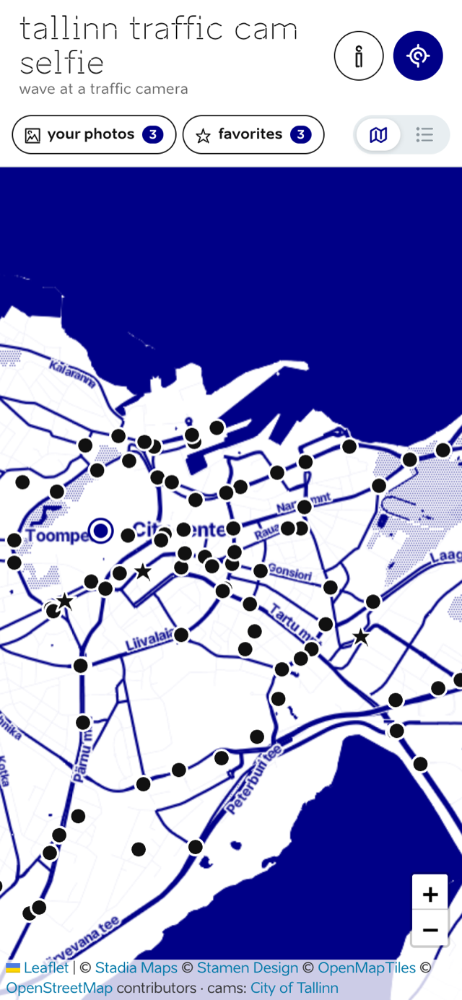
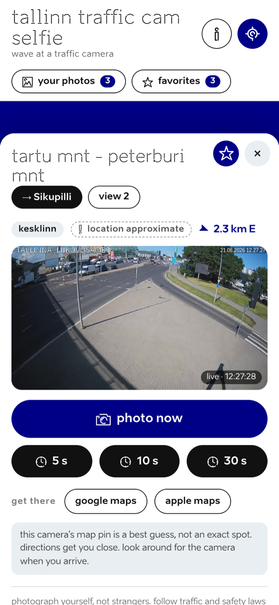
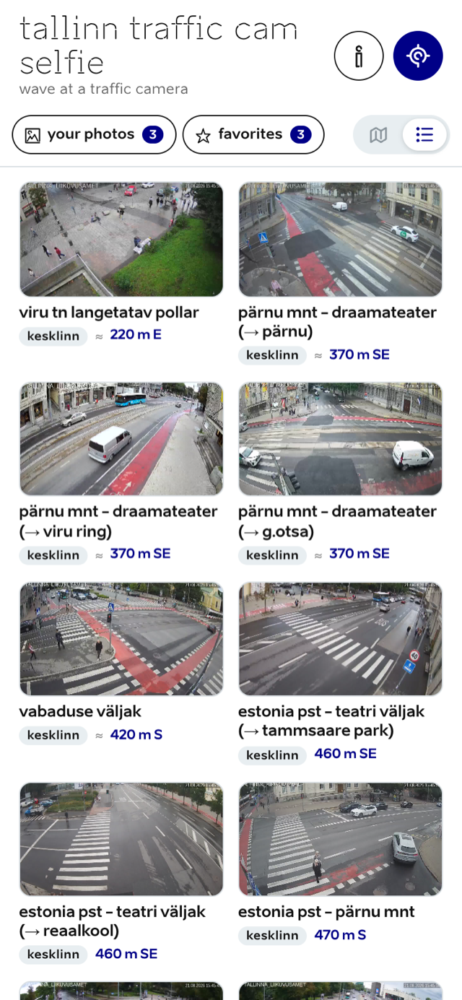
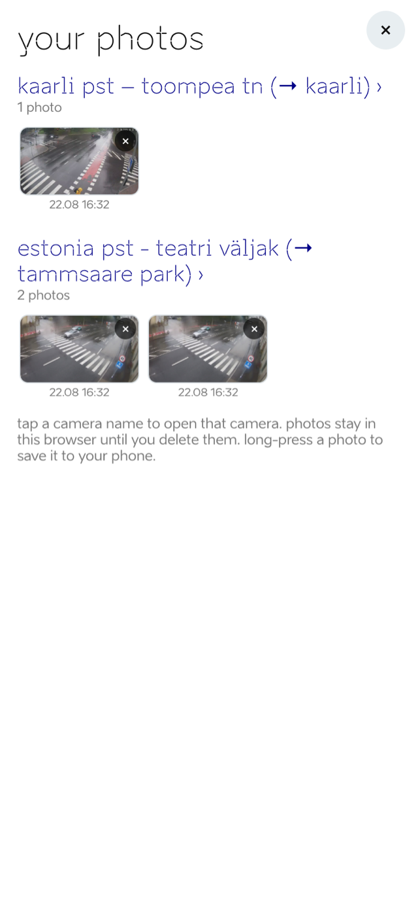
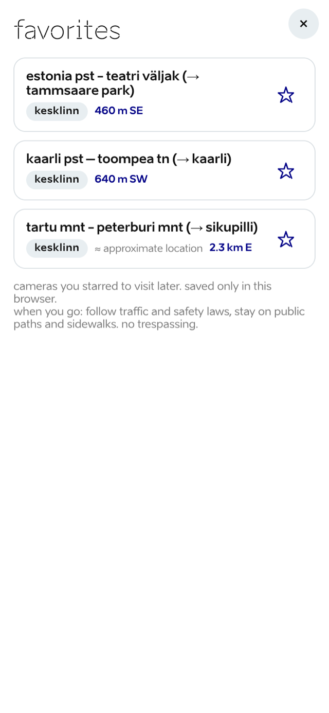

[](https://ko-fi.com/C3P325H540)
# tallinn cam selfie

A mobile-first web app that turns Tallinn's public traffic cameras into selfie
cameras: pick a camera on the map, walk to it, start a big-screen countdown,
wave, and the app grabs the frames with you in them.

Camera images come from the city's open camera service
[ristmikud.tallinn.ee](https://ristmikud.tallinn.ee) (253 cameras, refreshed
every few seconds). Design modeled after
[visitestonia.com](https://visitestonia.com/en): Aino Headline for titles,
Aino for everything else (Brand Estonia's typefaces), lowercase headlines,
black/white with deep-blue accents.

## Preview

<p align="center">
  
</p>

| camera page | list view | your photos | favorites |
|---|---|---|---|
|  |  |  |  |

## Run it

```bash
python3 -m http.server 8123 --directory app
```

Open http://localhost:8123. Location and photo persistence need a secure
context: `localhost` works as-is; on a phone the app must be served over
**HTTPS**.

Useful URL params: `?at=59.449,24.735` fakes your location (desktop testing),
`?cam=cam232` preselects a camera.

## Features

- **Map** (Leaflet + OSM) of all 253 city traffic cameras, grouped into 153
  spots; live user location with accuracy circle.
- **List view**: an iOS-style toggle in the nav switches the map for a
  scrollable grid of live feeds (nearest first when located, alphabetical
  otherwise) with district, distance, and a favorite star on each card. The
  chosen view is remembered. On open every feed loads once through a bounded
  queue (24 concurrent, nearest first, in-flight loads never aborted); after
  that only on-screen cards refresh every 30 s, and a stale card tops up the
  moment it scrolls into view. New frames swap in only after they've loaded,
  hung loads restart via a watchdog, and a feed that fails three times shows
  "no signal" instead of spinning (still retried while visible). Off-screen
  cards skip rendering entirely (content-visibility).
- **Camera page**: live preview (5 s refresh), distance + compass bearing,
  walking directions handoff to Google/Apple Maps, multi-view switcher where
  one junction has several cameras, and a share button that sends the
  camera's deep link (`?cam=<id>`) via the native share sheet (clipboard
  fallback). Cameras with `"approx": true` coordinates show a "location
  approximate" badge and a note next to directions.
- **photo now**: grabs the current frame.
- **Countdown photo** (5/10/30 s): fullscreen countdown with huge digits
  readable from across the street, beeps, screen wake-lock, then a "smile!"
  flash and a 3-frame burst (at zero / +4 s / +8 s) since the cameras refresh
  every few seconds.
- **your shots**: captured frames persist in the browser (metadata in
  localStorage, pixels in Cache Storage via a service worker, so they survive
  refresh without any server). Delete any shot via the x with confirmation.
- **your photos**: gallery of every shot, grouped by camera, newest first;
  tap a camera's name to jump to it on the map.
- **favorites**: star cameras into a visit-later list with district and
  live distance; tap a row to open the camera.
- **Safety copy**: photograph-yourself-only, traffic-law, and no-trespassing
  disclaimers on the camera sheet, the favorites page, the countdown, and in
  about & privacy. UI icons come from the Brand Estonia icon set.
- **Install as an app**: web app manifest and apple touch icon; on iPhone use
  Share → Add to Home Screen for a standalone full-screen app.
- **Outside-Tallinn greeting**: visitors located more than 40 km away get a
  one-time explainer (per visit) and the map stays on Tallinn instead of
  jumping to their city. Suppressed when arriving via a shared `?cam=` link.

## Data pipeline

`app/data/cameras.json` is generated by:

```bash
python3 scripts/update-cameras.py
```

It scrapes the district pages of ristmikud.tallinn.ee, then geocodes each
junction name by intersecting street geometries from OpenStreetMap Overpass,
geocodes P&R addresses via Maa-amet in-ADS, and falls back to hand-placed
coordinates for grade-separated interchanges and named spots (62 of 253 are
approximate; `"approx": true` in the JSON). Overpass responses are cached in
`.cache/`.

## Deploy (GitHub Pages)

A workflow at `.github/workflows/pages.yml` publishes the `app/` folder on
every push to `main`. One-time setup after pushing the repo to GitHub:
repository **Settings → Pages → Source: GitHub Actions**. The app then lives
at `https://<user>.github.io/<repo>/` with HTTPS, which enables geolocation
and photo persistence on phones.

### Map tiles API key (Stadia Maps)

The map uses Stamen Toner tiles hosted by Stadia Maps. localhost works
without a key; production needs one (free tier at
[stadiamaps.com](https://stadiamaps.com/)):

1. Create a Stadia Maps account and an API key. In their dashboard,
   restrict the key to your domains (e.g. `<user>.github.io`). The key ships
   in the page source, so the domain restriction is what protects it.
2. Locally (optional): paste it into `.env` (`STADIA_API_KEY=...`, see
   `.env.example`) and run `sh scripts/build-config.sh` to generate
   `app/config.js`. Both files are gitignored.
3. For deploys: `gh secret set STADIA_API_KEY` (or repository Settings →
   Secrets and variables → Actions). The workflow injects it at deploy time.

Without a key the deployed app automatically falls back to plain
OpenStreetMap tiles, so nothing breaks; it just loses the blue toner look.

## Licences & data sources

Code is MIT (see [LICENSE](LICENSE)). Camera imagery is the City of
Tallinn's; map data and derived camera coordinates are © OpenStreetMap
contributors (ODbL) with address data from the Estonian Land Board; fonts are
Brand Estonia's Aino family; the map library is Leaflet (BSD-2). Full
attributions, licence texts, and the GDPR/privacy summary are in
[THIRD-PARTY-NOTICES.md](THIRD-PARTY-NOTICES.md) and in the app's
**about & privacy** screen (the ⓘ button).

## Notes

- Camera frames are served by the city; images are typically a few seconds
  old. The burst exists because the exact refresh lag varies per camera.
- The traffic-camera service is Tallinn's; be a decent human on camera.
- Fonts are Brand Estonia's freely available Aino family, served locally from
  `app/fonts/`.
